# Features

The Trail of Reasoning system offers a comprehensive set of features designed to enhance reasoning processes across various domains and use cases. This document outlines the core features, highlighting their capabilities, benefits, and technical implementation.

## Core Features

### Tiered Reasoning Framework

The Trail of Reasoning system is built around a tiered approach to reasoning that breaks complex problems into logical stages, enabling more transparent and controllable thought processes.

Each reasoning trail consists of multiple tiers that represent progressive stages in the reasoning process. These tiers follow a natural progression from problem definition to solution development, with each tier building on the insights and artifacts from previous tiers. The system provides built-in tier templates for common reasoning patterns, such as problem decomposition, solution exploration, and implementation planning.

The tiered structure creates natural checkpoints for human review and intervention, ensuring that the reasoning process remains aligned with human intent and expectations. At each tier boundary, users can review artifacts, provide feedback, and guide the subsequent reasoning process, creating a collaborative human-AI workflow.

This approach ensures that complex reasoning processes are broken down into manageable components, making them easier to understand, evaluate, and refine. It also creates a structured record of the reasoning process that can be referenced, shared, and audited as needed.

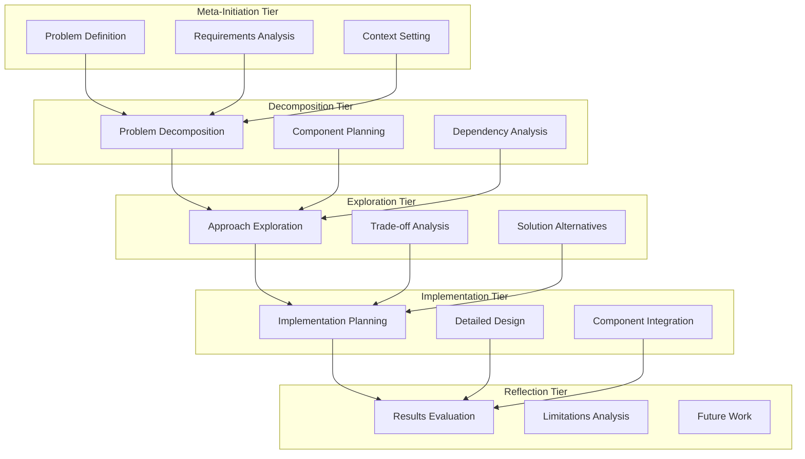

### Thread-to-Trail Mapping

The system provides sophisticated thread-to-trail mapping that enables multiple conversation threads to interact with the same underlying reasoning trails, ensuring consistent context and seamless collaboration.

The ConversationContextManager maintains a mapping between user conversation threads and reasoning trails, enabling users to maintain multiple parallel conversations across different reasoning processes. This mapping ensures that each thread has access to the appropriate trail context and state.

Thread context persistence enables users to resume conversations seamlessly across sessions, maintaining their position and context within the reasoning process. This persistence is achieved through a combination of explicit context tracking and implicit state inference.

Multi-user collaboration is supported through distinct conversation threads that can interact with the same underlying trail, enabling different users to contribute to the same reasoning process from their own conversation contexts. This collaborative capability ensures that teams can work together effectively on complex reasoning tasks.

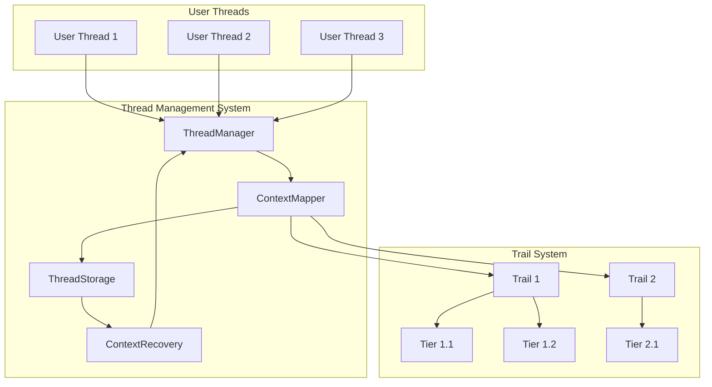

The thread-to-trail mapping system provides several key capabilities:

1. **Multiple Context Support**: Users can maintain multiple conversation threads for different reasoning processes or perspectives
2. **Session Continuity**: Conversations can be paused and resumed across sessions with full context preservation
3. **Thread Switching**: Users can easily switch between different conversation threads while maintaining state
4. **Thread Sharing**: Conversation threads can be shared with other users for collaboration
5. **Thread History**: The complete history of a conversation thread is preserved for context and reference

These capabilities ensure that the conversational interface remains coherent and contextual even across complex reasoning processes and extended time periods.

### Context Propagation

The system maintains consistent context across tiers through sophisticated context propagation mechanisms, ensuring continuity in the reasoning process.

Context from each tier is automatically summarized and propagated to subsequent tiers, ensuring that all relevant information is preserved throughout the reasoning process. The system uses intelligent context management to highlight key insights, decisions, and constraints that should influence subsequent reasoning.

The context propagation mechanism includes different strategies to handle various reasoning scenarios. The summarization strategy provides concise summaries of previous tiers to preserve essential context without overwhelming subsequent reasoning. The selective inclusion strategy identifies specific artifacts or insights that should be explicitly included in subsequent reasoning. The dependency tracking strategy maintains clear visibility of how each tier's reasoning depends on previous tiers, enabling impact analysis for changes or refinements.

This context propagation ensures that reasoning remains consistent and coherent throughout the process, avoiding disconnected or contradictory reasoning across tiers. It also enables effective reasoning over extended processes that would otherwise exceed model context windows, making it possible to tackle complex problems that require multiple reasoning stages.

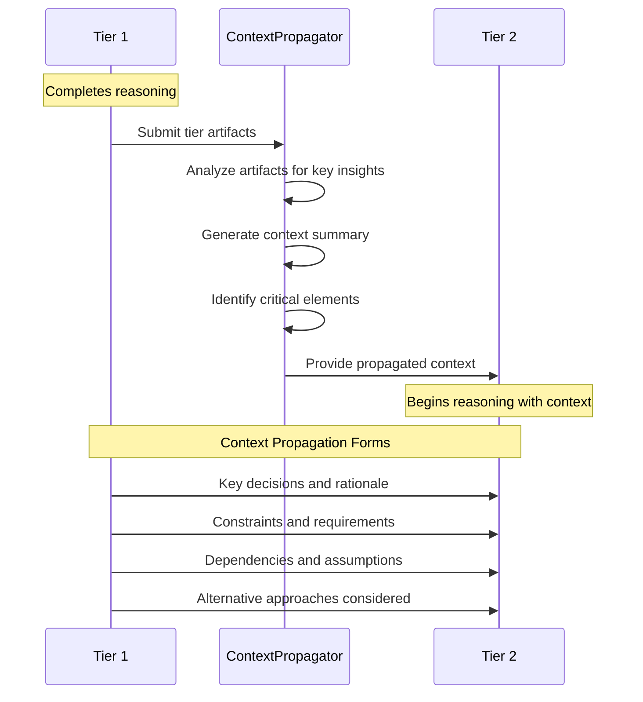

### Prompt Management

The system includes sophisticated prompt management capabilities that ensure effective communication with language models throughout the reasoning process.

A comprehensive prompt template library provides specialized templates for different reasoning stages and domains, ensuring that prompts effectively guide model reasoning. These templates incorporate best practices for eliciting high-quality reasoning, including explicit reasoning instructions, structured output formats, and multi-step prompting patterns.

Dynamic prompt generation adapts templates based on tier context, user preferences, and the specific reasoning task, ensuring that prompts remain relevant and effective. The system intelligently manages prompt complexity based on model capabilities, ensuring that prompts are appropriately sized and structured for the target model.

The system supports both system-level prompt templates that define the overall interaction framework and tier-specific prompt templates that focus on particular reasoning stages. This dual-level approach ensures consistent system behavior while allowing specialization for different reasoning tasks.

#### Prompt Lifecycle Management

Prompts follow a well-defined lifecycle represented by the `PromptPhase` enum with formal stages:

1. **Preparation Phase**: Context gathering, template selection, and parameter population
2. **Execution Phase**: Sending to the LLM and monitoring processing
3. **Processing Phase**: Handling LLM response and extracting artifacts
4. **Recording Phase**: Capturing metrics, storing results, and updating history

The PromptStateMachine manages transitions between these phases, ensuring consistency and proper tracking:

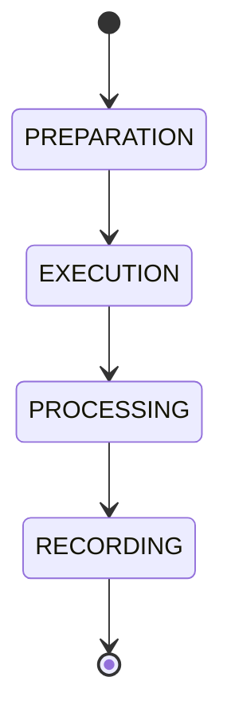

Each phase transition is recorded with comprehensive metadata including:

- Timestamp and duration
- Success/failure status
- Performance metrics
- Confidence scoring
- Debugging information

This lifecycle management ensures rigorous tracking of prompt execution, enabling quality assessment and continuous improvement.

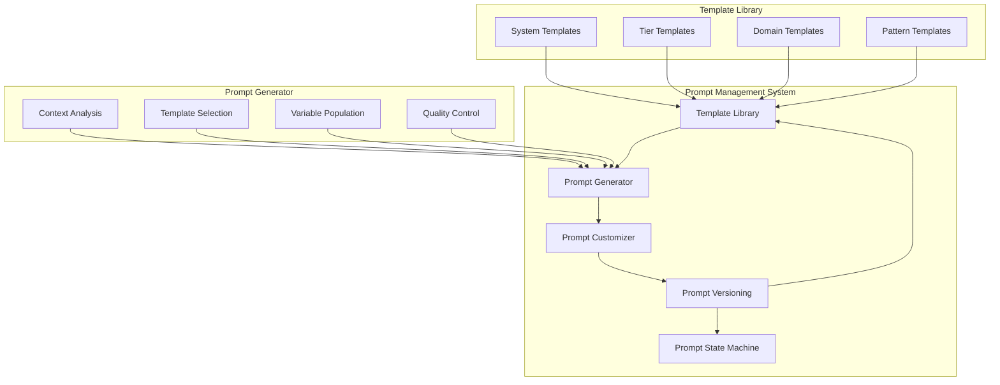

### Artifact Management

The Trail of Reasoning system provides comprehensive artifact management capabilities that organize, track, and version all outputs generated during the reasoning process.

The system automatically captures, categorizes, and indexes all artifacts produced during reasoning, creating a comprehensive record of the reasoning process. These artifacts include not only final outputs but also intermediate reasoning steps, alternatives considered, and decision rationales.

Artifacts are organized based on their tier, type, and relationships, creating a structured repository that can be easily navigated and queried. Each artifact is automatically versioned, allowing users to track changes, compare alternatives, and revert to previous versions if needed.

#### Artifact Lifecycle Management

Artifacts progress through a formal lifecycle represented by the `ArtifactStage` enum:

1. **Creation Stage**: Initial generation from prompt execution
2. **Verification Stage**: Quality assessment and validation
3. **Refinement Stage**: Improvement based on feedback and analysis
4. **Completion Stage**: Final verification and approval

The ArtifactStateMachine manages transitions between these stages, enforcing rules about allowed transitions and recording verification history:

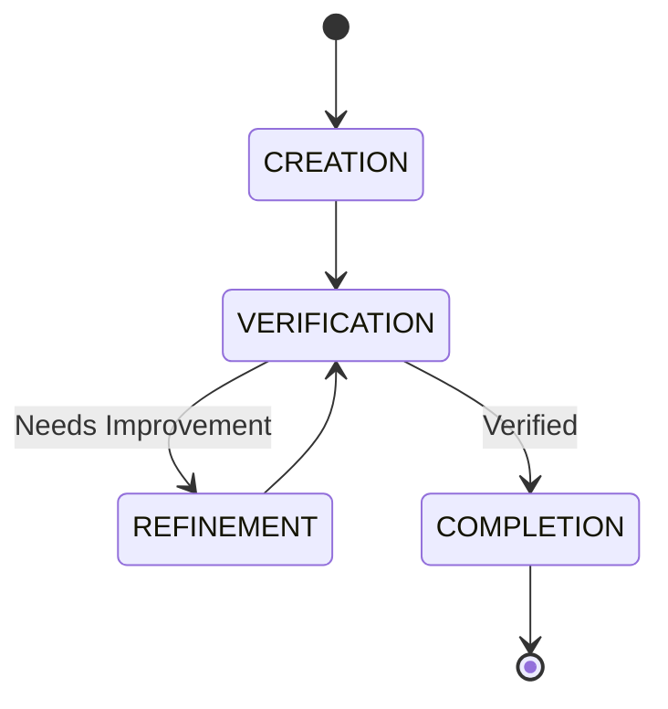

Each stage transition is recorded in the artifact's verification history, creating a comprehensive audit trail that includes:

- Who performed the verification
- What feedback was provided
- Verification metrics and confidence scores
- Timestamp and contextual information

The artifact registry maintains clear dependency relationships between artifacts, enabling impact analysis for changes and ensuring consistency across the reasoning trail. It also supports rich metadata that provides context for each artifact, including its purpose, creation context, and relationship to other artifacts.

These artifact management capabilities ensure that nothing is lost during complex reasoning processes, providing a complete record that can be reviewed, shared, and leveraged for future work. They also enable effective collaboration by giving all participants visibility into the full reasoning context and history.

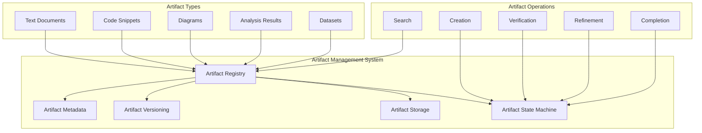

### Human-in-the-Loop (HITL) Coordination

The system provides robust support for human-in-the-loop interactions, enabling effective collaboration between humans and AI throughout the reasoning process.

The HITL coordination features identify appropriate interaction points where human input would be most valuable, avoiding unnecessary interruptions while ensuring human guidance at critical decision points. These interaction points are determined based on factors such as decision importance, uncertainty levels, and the need for domain expertise.

The system presents contextual information and options at each interaction point, helping users make informed decisions without needing to review the entire reasoning process. It also provides clear explanations of the reasoning state, progress, and potential next steps to orient users quickly.

Feedback integration mechanisms enable the system to effectively incorporate human guidance into subsequent reasoning, ensuring that feedback influences all relevant aspects of the reasoning process. The system can also adapt its interaction patterns based on user preferences and patterns, providing more or less autonomy as appropriate.

These HITL coordination capabilities create a true collaborative intelligence where human expertise and AI capabilities complement each other, producing results that neither could achieve alone. They also ensure that humans maintain appropriate oversight of the reasoning process, aligning with responsible AI practices.

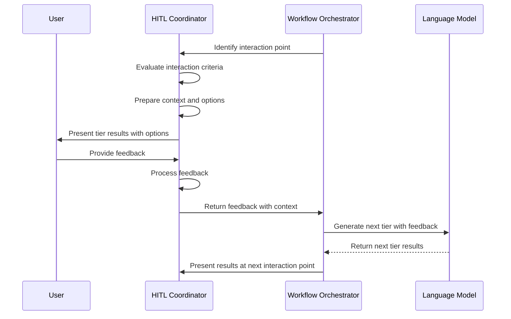

### Configurable Automation Modes

The system supports multiple automation modes that control the level of human involvement in the reasoning process, from fully automated to highly interactive. These modes define how humans and AI interact throughout the reasoning process.

For comprehensive information on automation modes including implementation details, interaction patterns, use cases, and configuration options, see [Trail Automation Modes](trail-automation.md).

The system supports five automation modes with progressively increasing human involvement:

1. **Autonomous AI**: AI operates independently with minimal human intervention
2. **Human-Supervised AI**: AI suggests and executes actions with human approval
3. **Co-Design**: Human and AI collaborate equally on solution development
4. **AI-Supported Human**: AI provides recommendations while humans make final decisions
5. **Human-Directed**: Human maintains complete control, AI functions as a tool

These modes can be configured globally at the trail level, at the tier level for specific stages, or adjusted dynamically during execution based on confidence scores or other metrics.

### Trail Map as System Backbone

The trail-map.json serves as the backbone of the system, providing a structured representation of the entire reasoning process:

```mermaid
graph TD
    subgraph "Trail Map Integration"
        TM[Trail Map]
        SM[State Manager]
        TR[Trail Runner]
        DP[Dispatcher]
    end
    
    subgraph "Components Reading Trail Map"
        UI[User Interface]
        SU[Status Updates]
        AC[Action Suggestions]
        RE[Reporting Engine]
    end
    
    TM <--> SM: State persistence
    TM <--> TR: Execution guidance
    TM <--> DP: Intent routing
    
    TM --> UI: Displays current state
    TM --> SU: Progress tracking
    TM --> AC: Context-aware suggestions
    TM --> RE: Generate reports
```

The trail map provides:

1. **Single Source of Truth**: A consistent representation of the current state that all components can reference
2. **Historical Record**: Tracking how the reasoning process evolved over time
3. **Navigation Structure**: Allowing users to move between different parts of the reasoning process
4. **Artifact Traceability**: Linking prompts, outputs, and derivative artifacts
5. **Status Monitoring**: Providing visibility into progress and pending actions

This integration ensures that all components work with a consistent understanding of the reasoning process state while enabling features like history browsing, state comparison, and point-in-time restoration.

### Multi-Provider Support

The Trail of Reasoning system supports integration with multiple language model providers, offering flexibility and adaptability across different deployment scenarios.

The provider abstraction layer enables seamless integration with various language model providers, including Cursor IDE, MCP servers, and local models. This abstraction handles provider-specific communication protocols, authentication mechanisms, and output formats, ensuring consistent behavior regardless of the underlying provider.

The system intelligently adapts to provider capabilities, adjusting prompt strategies, context handling, and artifact expectations based on the specific model's capabilities. It also implements robust fallback mechanisms that can switch between providers based on availability, cost, or performance considerations.

This multi-provider support enables the Trail of Reasoning system to operate effectively in various environments, from cloud-based scenarios with external API access to air-gapped environments with local models only. It also provides flexibility for organizations to choose the most appropriate models for their specific needs, considering factors such as cost, performance, and data sensitivity.

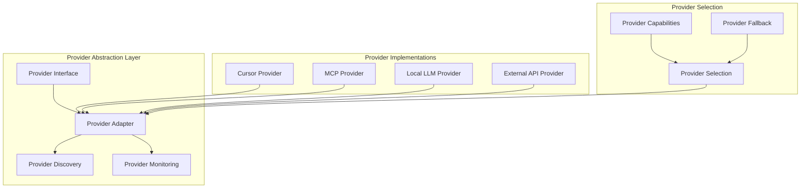

## Advanced Features

### Reasoning Pattern Library

The system includes a comprehensive library of reasoning patterns that encapsulate best practices for different types of reasoning tasks.

Each reasoning pattern defines a structured approach to a specific type of reasoning task, including recommended tiers, prompt templates, and evaluation criteria. These patterns are based on established methodologies and best practices for different reasoning domains, such as problem decomposition, solution evaluation, or risk analysis.

The pattern library includes both domain-agnostic patterns that apply across multiple fields and domain-specific patterns that incorporate specialized knowledge and approaches. This combination ensures that the system can effectively support reasoning in various contexts while maintaining consistency in its core approach.

Users can select, customize, and combine patterns to create tailored reasoning workflows for their specific needs. The system also supports pattern extensibility, allowing organizations to define custom patterns that reflect their unique reasoning methodologies or domain knowledge.

This reasoning pattern library accelerates the development of effective reasoning trails by providing proven templates that can be quickly applied to new problems. It also ensures consistency across reasoning processes, making them more predictable and easier to understand.

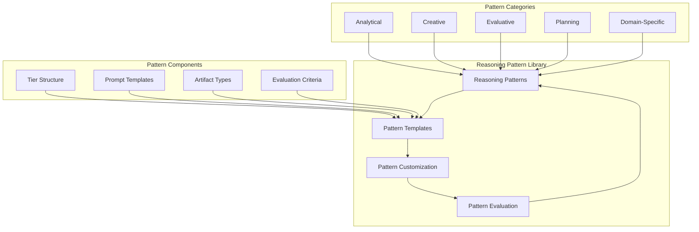

### Reasoning Evaluation

The system provides sophisticated evaluation capabilities that assess reasoning quality, identify potential issues, and suggest improvements.

Automated reasoning evaluation applies various criteria to assess the quality of reasoning trails, including logical coherence, evidence utilization, consideration of alternatives, and alignment with domain knowledge. These evaluations help identify strengths and weaknesses in the reasoning process, guiding continuous improvement.

The evaluation framework includes both universal criteria that apply to all reasoning processes and domain-specific criteria that reflect the unique requirements of different fields. This combination ensures comprehensive evaluation that considers both general reasoning principles and specialized domain knowledge.

Comparative evaluation enables users to assess multiple reasoning approaches for the same problem, identifying the most effective strategies and learning from the differences. The system can also benchmark reasoning against reference examples or best practices to provide objective quality assessments.

These evaluation capabilities promote continuous improvement in reasoning quality by providing objective feedback and actionable suggestions. They also help organizations maintain consistent reasoning standards across multiple projects and teams.

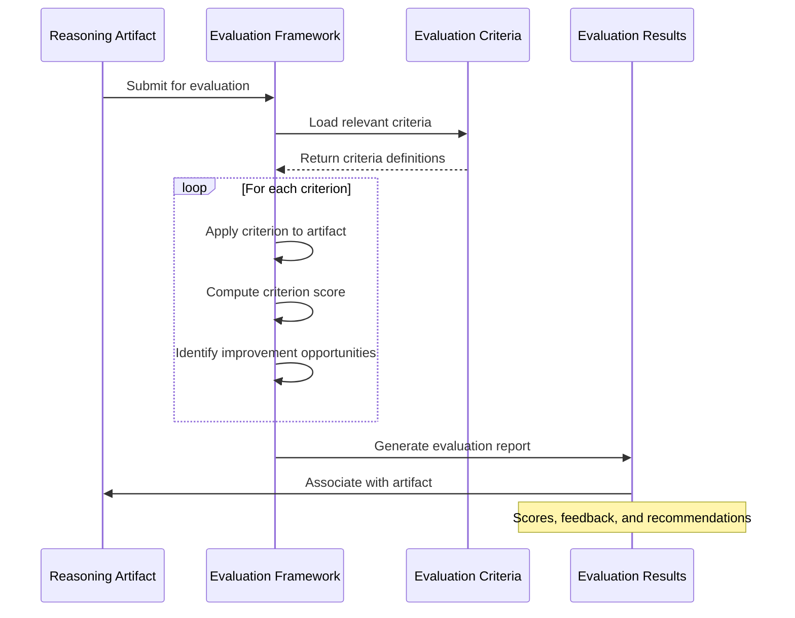

### Collaborative Workflows

The system supports collaborative reasoning workflows where multiple users can contribute to the same reasoning trail, leveraging collective expertise and perspectives.

The collaboration framework enables multiple users to participate in the reasoning process, with clear roles and permissions that define their specific contributions and responsibilities. These roles can include initiators who define the problem, domain experts who provide specialized knowledge, reviewers who evaluate reasoning quality, and approvers who validate final outcomes.

Real-time collaboration features enable synchronous work on reasoning trails, with visibility into other users' activities and contributions. The system also supports asynchronous collaboration through notification mechanisms that alert users to changes, updates, or required actions.

Conflict resolution mechanisms help manage situations where different users have conflicting perspectives or recommendations, facilitating productive resolution that incorporates diverse viewpoints. The system maintains a comprehensive audit trail of all user contributions, ensuring accountability and traceability throughout the collaborative process.

These collaborative workflow capabilities make the Trail of Reasoning system effective for team-based reasoning processes, where diverse expertise and perspectives can enhance reasoning quality and outcomes.

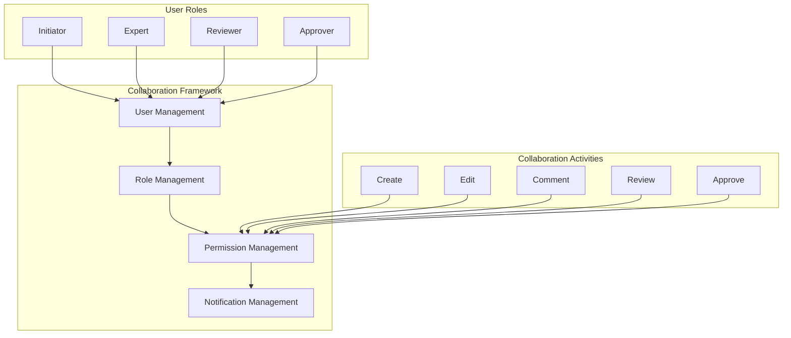

### Integration Capabilities

The system offers extensive integration capabilities that enable it to connect with various tools, platforms, and workflows.

#### Conversational Integration

The ConversationManager provides a sophisticated interface for natural language interaction with the reasoning system:

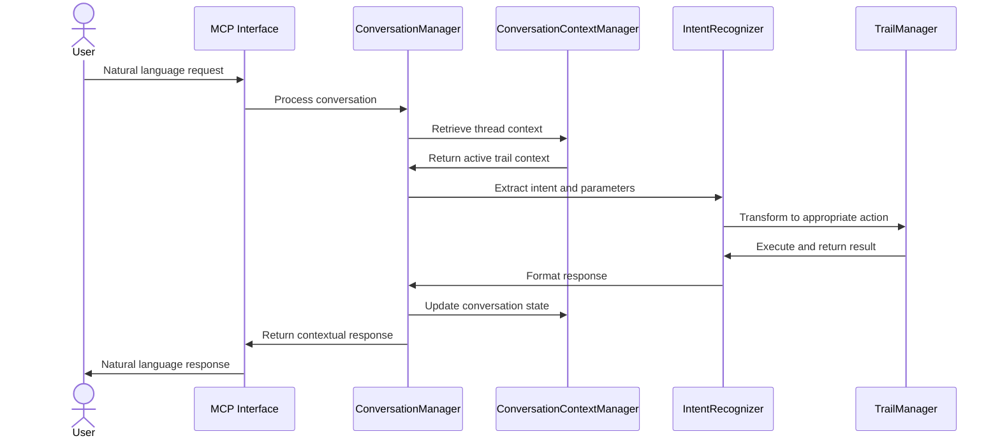

This conversational interface enables:

- Natural language interaction with reasoning capabilities
- Context-aware responses based on conversation history
- Seamless handling of complex intents and follow-up questions
- Multi-turn reasoning with state preservation

#### Programmatic Integration (API)

The system provides comprehensive API integration options for embedding Trail of Reasoning capabilities into custom applications:

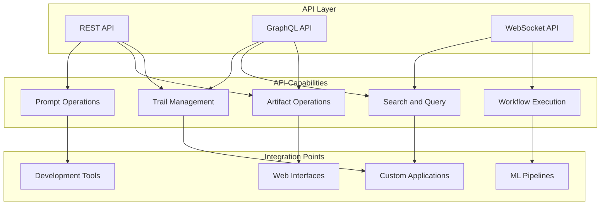

The API layer provides:

1. **REST API**: For standard CRUD operations on trails, tiers, artifacts, and prompts
2. **GraphQL API**: For flexible, client-driven querying of reasoning data
3. **WebSocket API**: For real-time updates and event-driven integrations

These APIs enable custom frontends, automation systems, and third-party tools to leverage Trail of Reasoning capabilities seamlessly.

#### Development Environment Integration

The Cursor IDE integration provides seamless workflow within the development environment, leveraging code context for more relevant reasoning and enabling direct implementation of reasoning outcomes. This integration creates a unified development experience where reasoning and implementation are closely connected.

MCP server integration enables the system to work with diverse model providers through the Model Context Protocol, leveraging specialized models for different reasoning tasks and ensuring consistent context management across providers. This integration allows organizations to combine the unique capabilities of different models for more effective reasoning.

External tool integration connects the Trail of Reasoning system with various specialized tools for data analysis, visualization, or domain-specific processing. These integrations enable the system to incorporate specialized capabilities that enhance the reasoning process or its outputs.

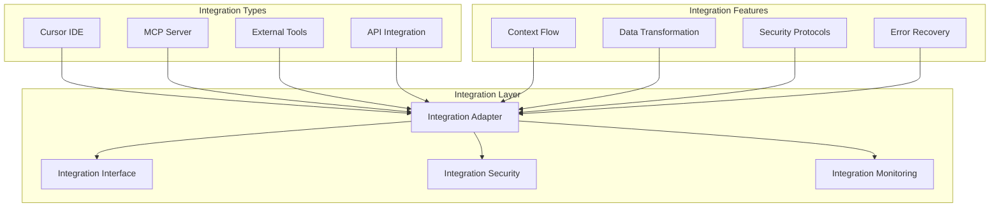

## User Experience Features

### Interactive Console

The system provides an interactive console that enables direct engagement with the reasoning process through a command-line interface.

The console offers a comprehensive set of commands for managing reasoning trails, including creation, navigation, execution, and review. These commands follow a consistent pattern that makes them intuitive and easy to remember, enhancing user productivity.

Real-time feedback during reasoning execution provides visibility into the reasoning process, with progress indicators, interim results, and estimated completion times. This feedback helps users understand the reasoning process and manage their expectations effectively.

The console supports both guided modes for new users, with step-by-step prompts and explanations, and expert modes for experienced users, with concise commands and abbreviated output. This dual approach makes the system accessible to new users while remaining efficient for experienced users.

This interactive console creates a direct and responsive interface to the Trail of Reasoning system, enabling effective control and visibility of the reasoning process from the command line.

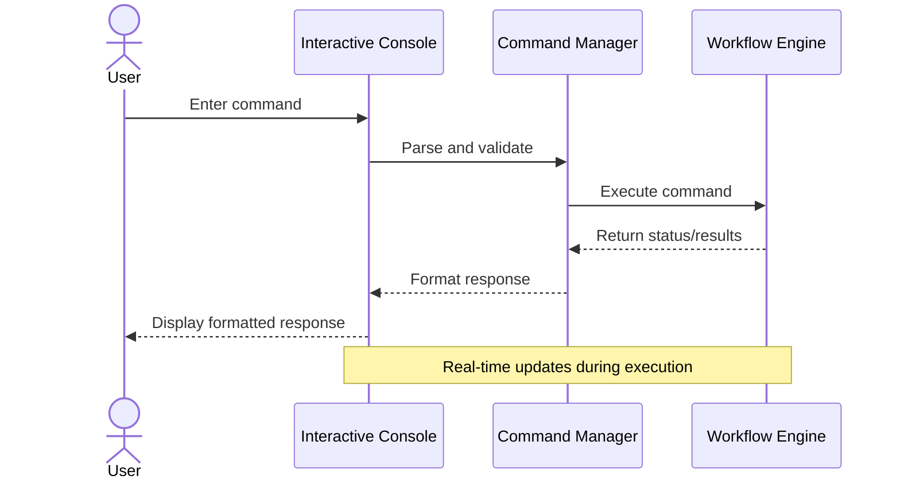

### Progress Visualization

The system includes visualization capabilities that make reasoning trails more accessible and understandable for all users.

The trail navigator provides an interactive visualization of the reasoning trail structure, showing tiers, their relationships, and progress status. This visualization helps users understand the overall reasoning process and navigate to specific points of interest.

Dependency visualizations illustrate relationships between different artifacts and reasoning components, helping users understand how different parts of the reasoning process connect and influence each other. These visualizations make complex reasoning structures more accessible and understandable.

Progress tracking visualizations show the current state of the reasoning process, including completed tiers, active work, and pending steps. These visualizations help users understand the current state and remaining work in the reasoning process.

These visualization capabilities enhance the usability of the Trail of Reasoning system by making complex reasoning processes more accessible and understandable for all users, regardless of their technical background.

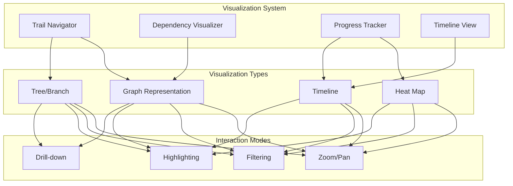

### Customizable Workflows

The system supports extensive customization of reasoning workflows to accommodate different preferences, processes, and requirements.

Custom tier definitions enable users to create specialized reasoning stages that reflect their specific methodology or domain requirements. These custom tiers can incorporate domain-specific prompts, artifact types, and evaluation criteria, ensuring alignment with specialized needs.

Workflow templates provide pre-configured reasoning paths for common scenarios, accelerating setup while ensuring consistent processes. These templates can be used as starting points and customized to meet specific requirements, providing a balance of standardization and flexibility.

Personalization options enable users to customize interaction patterns, notification preferences, and display formats according to their preferences. These personalization features make the system more comfortable and effective for individual users, enhancing productivity and satisfaction.

These customization capabilities ensure that the Trail of Reasoning system can adapt to diverse environments, methodologies, and preferences, making it effective across various contexts and use cases.

### Export and Sharing

The system provides robust capabilities for exporting and sharing reasoning trails and their artifacts.

Multiple export formats support different use cases and integrations, including structured formats like JSON and YAML for programmatic integration, document formats like Markdown and PDF for human readability, and specialized formats for integration with specific tools or platforms.

Selective export enables users to include only specific tiers, artifacts, or components in their exports, creating focused outputs for particular audiences or purposes. This selective approach ensures that exports contain exactly the information needed for their intended purpose.

Collaboration-friendly sharing features make it easy to share reasoning trails with other users or teams, with options for access control, annotation, and collaborative review. These features ensure that reasoning trails can be effectively shared and leveraged across teams and organizations.

These export and sharing capabilities extend the value of reasoning trails beyond their creation context, enabling their insights and approaches to be leveraged in various scenarios and by diverse audiences.

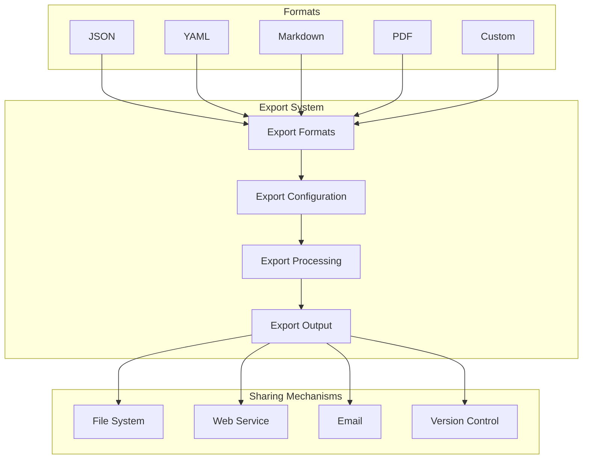

## Summary

The Trail of Reasoning system offers a comprehensive set of features designed to enhance reasoning processes across various domains and use cases. From its core tiered reasoning framework to advanced integration capabilities, these features work together to create a powerful system for collaborative, transparent, and effective reasoning.

Key benefits of these features include:

1. **Enhanced Transparency**: Clear documentation of each step, decision, and consideration builds trust in reasoning outcomes and enables effective review and refinement

2. **Contextual Persistence**: Thread-to-trail mapping ensures conversation continuity and context preservation across sessions and users

3. **Formal Lifecycles**: Well-defined artifact and prompt stages with state machines ensure consistent tracking and quality assessment

4. **Flexible Automation**: Multiple automation modes adapt to different user needs and task requirements

5. **Comprehensive Integration**: API-based, conversational, and development environment integrations enable flexible deployment

6. **Collaborative Workflows**: Multi-user support with role-based access control facilitates team-based reasoning

These features make the Trail of Reasoning system a versatile platform for enhancing reasoning processes across multiple domains, from software development and research to education and business decision-making.
