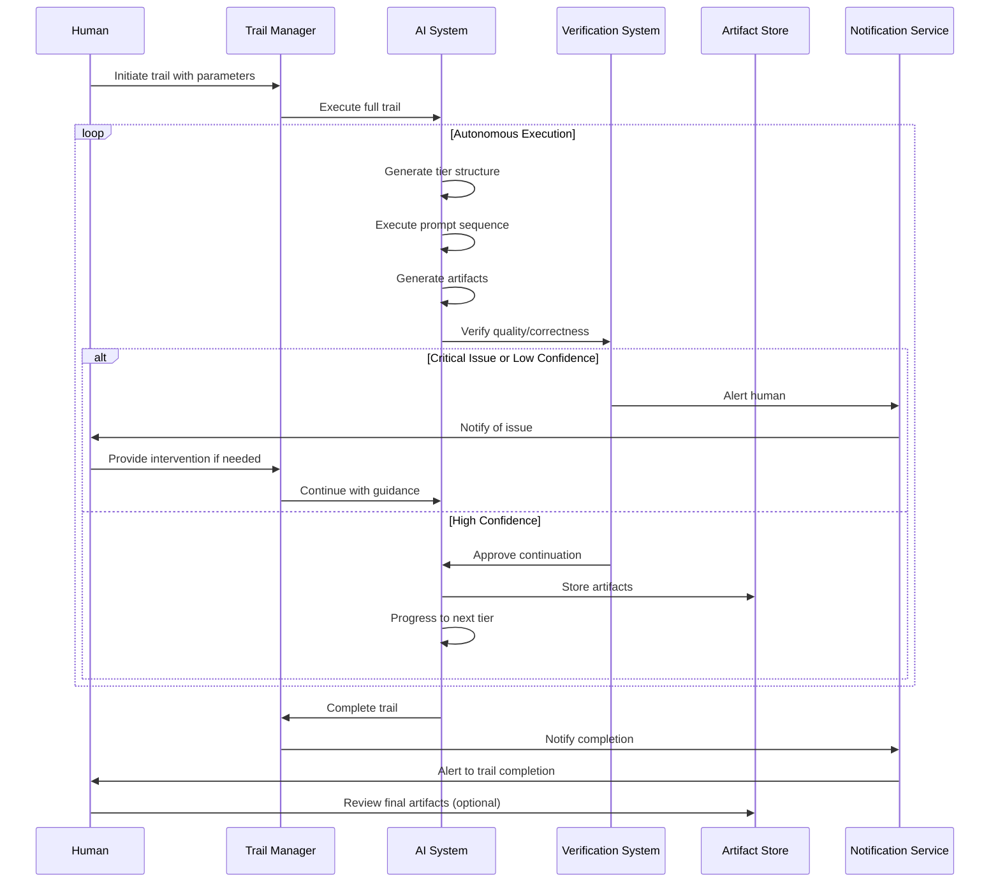
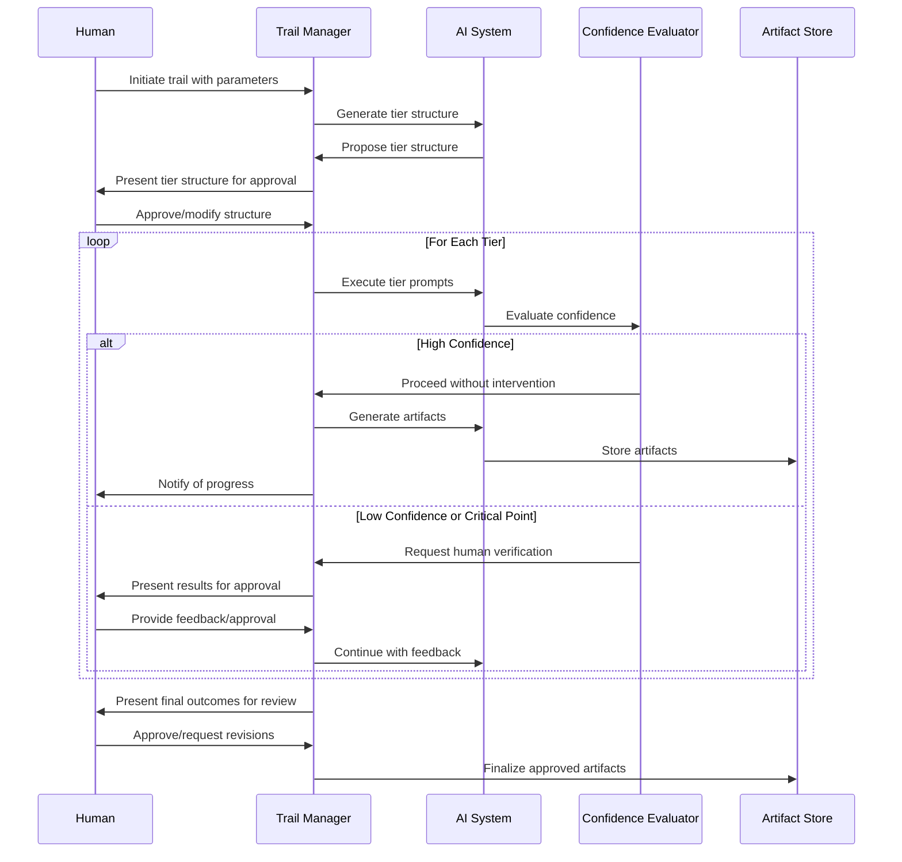
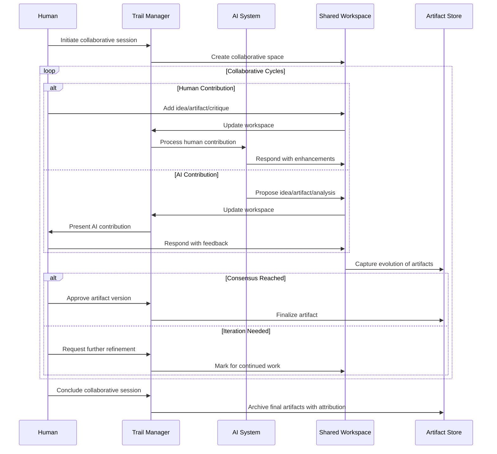
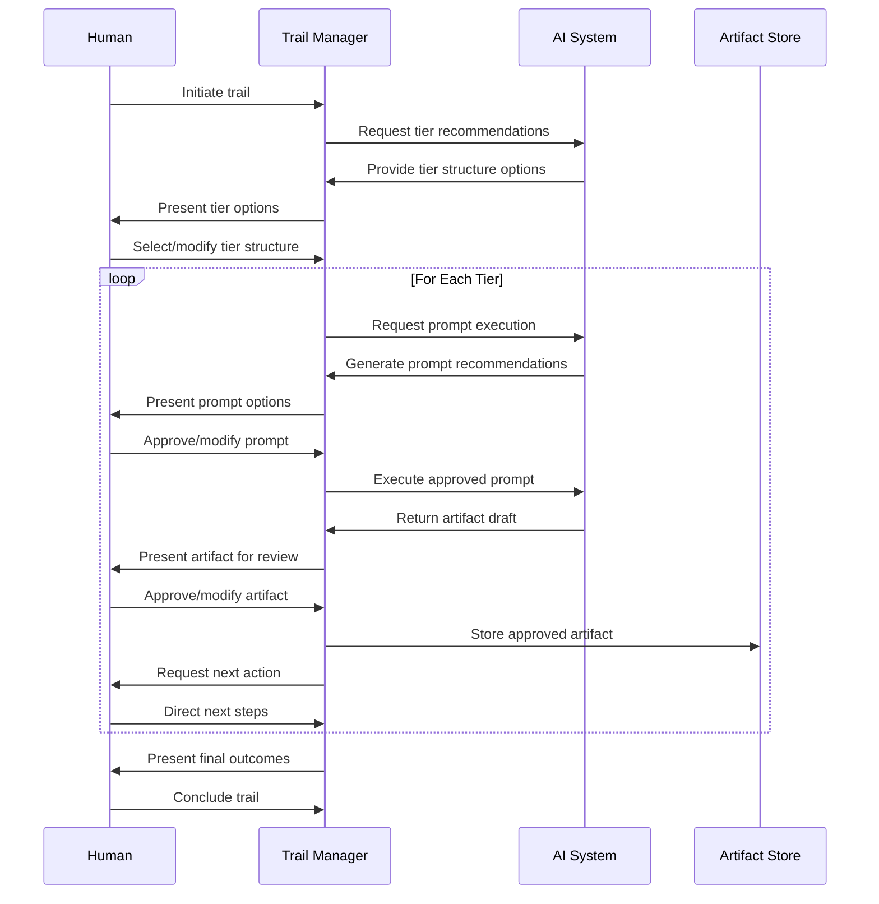
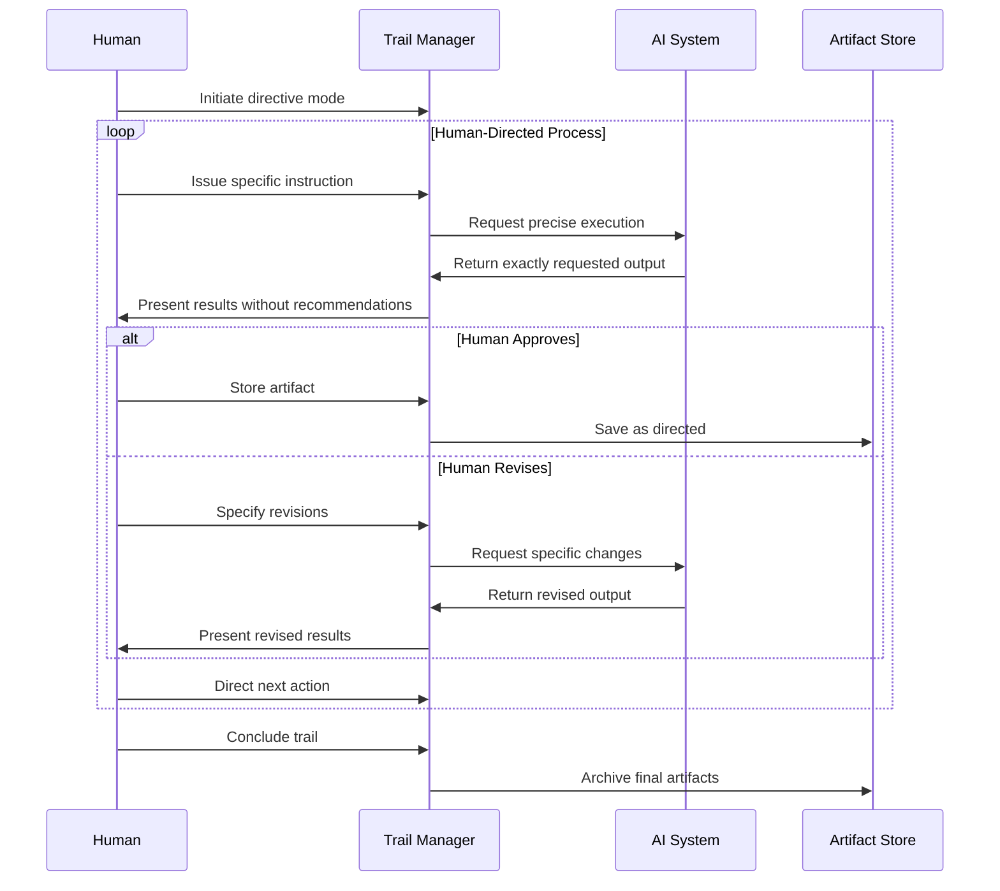

# Trail of Reasoning Automation Modes

## Introduction

The Trail of Reasoning system supports multiple automation modes that define how humans and AI interact throughout the reasoning process. These modes balance control, efficiency, and collaboration to accommodate different user needs, project requirements, and situational contexts.

This document serves as the canonical source for automation mode terminology and mechanics in the Trail of Reasoning system. It defines each mode's characteristics, appropriate usage scenarios, interaction patterns, and implementation details.

## Automation Mode Overview

The Trail of Reasoning system supports five distinct automation modes:

| Mode | Description | Human Role | AI Role | Interaction Pattern |
|------|-------------|------------|---------|---------------------|
| **Autonomous AI** | AI operates independently with minimal human intervention | Observer | Primary actor | AI-driven with human notifications |
| **Human-Supervised AI** | AI suggests and executes actions with human approval | Reviewer | Executor | AI-driven with human approval gates |
| **Co-Design** | Human and AI collaborate equally on solution development | Co-creator | Co-creator | Balanced contribution and interaction |
| **AI-Supported Human** | AI provides recommendations while human makes final decisions | Decision maker | Advisor | Human-driven with AI suggestions |
| **Human-Directed** | Human maintains full control, AI functions as a tool | Director | Tool | Human-driven with AI as utility |

## Autonomous AI

### AI as the Primary Actor with Minimal Intervention

In the **Autonomous AI** mode, the AI operates with high independence, executing the complete reasoning process with minimal human intervention. The AI makes decisions, generates artifacts, and progresses through tiers based on its own evaluation of quality and confidence.

This mode prioritizes efficiency and automation, with the human role shifting to monitoring and exception handling rather than direct participation in the reasoning process. The system notifies humans of significant events, issues that require attention, or when the trail is complete.

### When Automation and Efficiency Matter Most

This mode is recommended for:

- **Well-defined, routine problems** with established solution patterns
- **High-volume tasks** where efficiency is paramount
- **Low-risk contexts** where occasional errors have minimal consequences
- **Situations with clear success criteria** that can be automatically verified
- **Environments with time constraints** or where immediate responses are needed
- **Processes where consistency** is more important than creativity

### How AI Works Independently with Exception Handling



In this mode:

1. The AI executes the entire trail without requiring human approval
2. The system only alerts humans for critical issues or low-confidence results
3. Quality verification is handled automatically
4. The human is notified when the trail completes
5. The human can review the final outcome and request revisions if needed

### Applications Where Full Automation is Beneficial

- **Routine report generation** from standardized data
- **API documentation** based on code analysis
- **Test case generation** for well-defined functionality
- **Translation** of technical documentation
- **Data transformation** and preprocessing
- **Monitoring and alerts** generation
- **Personalized content recommendations**
- **Scheduled maintenance analysis**

## Human-Supervised AI

### AI as the Executor with Human Review

In the **Human-Supervised AI** mode, the AI takes a more active role in executing the reasoning process while still operating under human supervision. The AI suggests and implements actions, but requires human approval at key checkpoints and decision points.

This mode balances efficiency with control, allowing the AI to work more independently while ensuring that humans maintain oversight of the process. The AI can proceed autonomously through routine or high-confidence steps but must seek approval for critical decisions or uncertain situations.

### When Efficiency with Verification is Needed

This mode is recommended for:

- **Semi-structured problems** with established solution patterns
- **Moderate-complexity tasks** where efficiency matters but oversight is still needed
- **Mixed expertise situations** where both AI and human bring valuable perspectives
- **Production environments** with defined quality standards
- **Processes with clear verification criteria**
- **Situations requiring audit trails** but allowing partial automation

### How AI Works Independently with Checkpoints



In this mode:

1. The AI executes most steps independently
2. The system uses confidence thresholds to determine when to involve humans
3. Critical junctures (tier transitions, major decisions) always require human approval
4. The human can intervene at any point
5. Progress continues automatically after approvals

### Applications Where AI Can Drive with Human Reviews

- **Software development** where AI generates code but humans review
- **Content creation** where AI drafts content but humans edit and approve
- **Data analysis** where AI processes data but humans interpret key findings
- **Business intelligence** where AI identifies patterns but humans make business decisions
- **Product design** where AI generates options but humans select directions
- **Documentation generation** where AI creates drafts but humans ensure accuracy
- **Process optimization** where AI suggests improvements but humans validate feasibility

## Co-Design

### Human and AI as Equal Partners in Creation

In the **Co-Design** mode, humans and AI work together as equal partners, each contributing their unique strengths to the reasoning process. This mode emphasizes collaboration, with both parties actively participating in idea generation, critique, refinement, and decision-making.

This mode creates a dynamic exchange where humans and AI build on each other's contributions, resulting in outcomes that neither could achieve independently. The process is characterized by fluid interaction and mutual enhancement of capabilities.

### When Collaboration Yields the Best Results

This mode is recommended for:

- **Creative projects** requiring both innovation and feasibility
- **Complex design challenges** benefiting from multiple perspectives
- **Situations where human creativity and AI processing power complement each other**
- **Projects where the optimal solution is genuinely uncertain**
- **Explorative tasks** where iterations and rapid prototyping add value
- **Contexts where learning and discovery are primary goals**
- **Multidisciplinary challenges** requiring diverse expertise

### How Humans and AI Build Together Iteratively



In this mode:

1. Both human and AI can initiate ideas and contributions
2. The process is non-linear, with frequent iterations and refinements
3. All artifacts evolve through mutual contribution
4. The human and AI respond to each other's work
5. Attribution tracks both human and AI contributions
6. Either party can suggest moving to a new aspect or concluding

### Applications Where Synergy Creates Better Outcomes

- **Creative writing** where human and AI alternate contributions
- **Architectural design** combining aesthetic vision and technical feasibility
- **Product innovation** balancing creativity with practical constraints
- **Research hypothesis development** merging intuition with data analysis
- **Educational content creation** combining pedagogical expertise with knowledge generation
- **Game design** mixing creative narrative with balanced mechanics
- **Interface design** combining usability expertise with implementation possibilities

## AI-Supported Human

### AI as an Advisor in Human-Driven Processes

In the **AI-Supported Human** mode, the AI functions primarily as an advisor or consultant, providing recommendations, analysis, and insights while the human retains full decision-making authority. The AI supports the human's reasoning process without taking independent action.

This mode emphasizes transparency and explanation, ensuring that the human understands the AI's suggestions and the reasoning behind them. The human has full visibility into all aspects of the trail and makes all substantial decisions.

### When Human Decision-Making Takes Priority

This mode is recommended for:

- **High-stakes decisions** where human judgment is critical
- **Complex reasoning tasks** requiring domain expertise
- **Learning scenarios** where humans want to understand the reasoning process
- **Sensitive domains** with legal, ethical, or safety implications
- **Novel or unusual problems** without established solution patterns
- **Regulatory contexts** requiring human accountability for decisions

### How AI Recommends While Humans Decide



In this mode:

1. The AI proposes each action but requires explicit human approval
2. Humans can modify any AI recommendation or artifact
3. The system presents multiple options when appropriate
4. All tier transitions require human confirmation
5. The human guides the overall direction of the trail

### Applications Where Human Judgment is Critical

- **Strategic planning** where stakeholder alignment is critical
- **Medical diagnosis support** where physicians need AI insights while maintaining responsibility
- **Legal reasoning** where attorneys need research support but must make judgments
- **Education and training** where learners need to understand each reasoning step
- **Security analysis** where human oversight of AI conclusions is essential
- **Design critique** where AI provides analysis but humans make creative decisions
- **Research exploration** where AI helps identify patterns but human expertise guides investigation

## Human-Directed

### AI as a Tool Following Human Instructions

In the **Human-Directed** mode, the human maintains complete control over the reasoning process, with the AI functioning as a tool that responds to specific requests without unsolicited actions or suggestions. The human directs every aspect of the trail, determining what tasks to perform and how to perform them.

This mode emphasizes precision and targeted utilization of AI capabilities, with the AI following explicit human instructions rather than taking initiative. The human orchestrates the entire process, with the AI enhancing human capabilities through specific requested actions.

### When Precise Control is Essential

This mode is recommended for:

- **Expert users** who know exactly what they need from the AI
- **Highly specialized tasks** requiring precise control
- **Situations where human expertise is paramount**
- **Contexts where AI suggestions might distract rather than help**
- **Processes with unique or non-standard approaches**
- **Regulatory environments** requiring full human control
- **Sensitive contexts** where any autonomous AI action is inappropriate

### How Humans Direct Every Step of the Process



In this mode:

1. The AI only acts when explicitly instructed
2. All suggestions or alternatives require human request
3. The system provides exactly what is asked for, no more
4. The human defines the structure and flow of the trail
5. The AI does not progress, suggest, or create without direction
6. All artifact creation, modification, and storage is human-driven

### Applications Where Human Expertise Must Lead

- **Specialized technical writing** where precise language is critical
- **Expert system development** where human knowledge must be captured exactly
- **Security-sensitive operations** requiring full human control
- **Scientific methodology design** where experimental rigor is essential
- **Legal document preparation** requiring exact terminology
- **Financial modeling** where assumptions must be precisely controlled
- **Regulatory compliance documentation** where specific language is mandated

## Configuration and Usage

### Setting Default Automation Preferences

The default automation mode can be set in the configuration file:

```json
{
  "automation": {
    "default_mode": "Human-Supervised AI",
    "confidence_thresholds": {
      "AI-Supported Human": 0.95,
      "Human-Supervised AI": 0.8,
      "Autonomous AI": 0.6,
      "Co-Design": 0.75,
      "Human-Directed": 0.99
    }
  }
}
```

### Customizing Automation for Individual Trails

Automation modes can be set for specific trails:

```json
{
  "trail_config": {
    "trail_id": "security_analysis_trail",
    "automation_mode": "AI-Supported Human"
  }
}
```

### Fine-Tuning Automation at the Tier Level

Different tiers within a trail can use different automation modes:

```json
{
  "tier_config": {
    "tier_id": "implementation_tier",
    "automation_mode": "Human-Supervised AI"
  }
}
```

### Changing Automation Modes During Execution

Automation modes can be changed dynamically during trail execution using conversation commands:

```bash
User: "Switch to AI-Supported Human mode for this section"
System: "Switching to AI-Supported Human mode. I'll provide recommendations but wait for your decisions before proceeding."
```

## Integration with Artifact Lifecycle

The automation mode significantly affects how artifacts progress through their lifecycle stages:

| Artifact Stage | AI-Supported Human | Human-Supervised AI | Autonomous AI | Co-Design | Human-Directed |
|----------------|-------------------|---------------------|---------------|-----------|----------------|
| **CREATION** | AI drafts, human finalizes | AI creates, human reviews | AI creates automatically | Collaborative creation | Human directs creation |
| **VERIFICATION** | Human verifies all | Human verifies critical/low-confidence | Automatic verification | Joint verification | Human verifies as needed |
| **REFINEMENT** | Human directs refinements | AI suggests refinements | Automatic refinement | Iterative refinement | Human specifies refinements |
| **COMPLETION** | Human approves completion | Human confirms completion | Automatic completion | Joint decision on completion | Human determines completion |

## Transitioning Between Modes

### Recognizing When to Shift Automation Levels

Transitions between modes are appropriate when:

- **Task complexity changes** (switching to more human-involved modes for complex sections)
- **Confidence levels fluctuate** (more automation for high-confidence areas)
- **Time constraints emerge** (more automation when time is limited)
- **Critical decisions arise** (more human involvement for key decisions)
- **User expertise varies** (more support for less familiar domains)

### How the System Handles Automation Mode Changes

Mode transitions preserve context and state while adjusting the interaction pattern:

```mermaid
stateDiagram-v2
    [*] --> "Current Mode"
    
    state "Current Mode" as CM
    
    state "Transition Process" as TP {
        [*] --> SaveState
        SaveState --> AdjustInteractionPattern
        AdjustInteractionPattern --> UpdateConfidenceThresholds
        UpdateConfidenceThresholds --> NotifyUser
        NotifyUser --> [*]
    }
    
    CM --> TP: Request Mode Change
    TP --> "New Mode": Complete Transition
    
    "New Mode" --> TP: Request Mode Change
```

### Transitioning from More to Less Automation: A Practical Example

When transitioning from **Human-Supervised AI** to **AI-Supported Human**:

1. The system saves the current state of all artifacts and prompts
2. Interaction patterns shift to require more explicit human approval
3. Confidence thresholds adjust to more conservative levels
4. The user is notified of the increased involvement required
5. The trail continues with the new interaction pattern

## Conclusion

The Trail of Reasoning automation modes provide a flexible framework for balancing human control and AI autonomy throughout the reasoning process. By selecting the appropriate mode for each situation, users can optimize for efficiency, control, creativity, or precision based on their specific needs.

These modes represent different interaction patterns rather than different capabilities—the underlying reasoning mechanics remain consistent, while the distribution of decision-making and initiative varies. This consistency ensures that trails maintain their methodological integrity regardless of the chosen automation mode.

By understanding the characteristics and applications of each mode, users can leverage the full potential of the Trail of Reasoning system across a wide range of use cases and domains.
